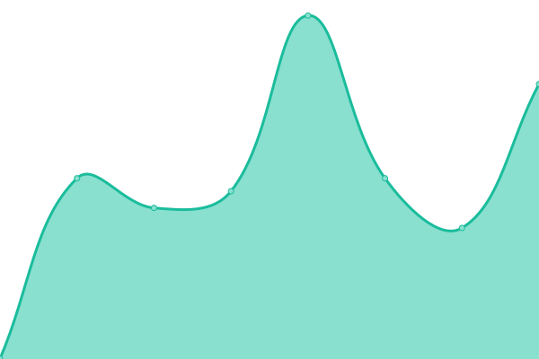

# [📈 Live Status](https://demo.upptime.js.org): <!--live status--> **🟧 Partial outage**

This repository contains the open-source uptime monitor and status page for [gedesco-git](https://demo.upptime.js.org), powered by [Upptime](https://github.com/upptime/upptime).

With [Upptime](https://upptime.js.org), you can get your own unlimited and free uptime monitor and status page, powered entirely by a GitHub repository. We use [Issues](https://github.com/gedesco-git/uptime/issues) as incident reports, [Actions](https://github.com/gedesco-git/uptime/actions) as uptime monitors, and [Pages](https://demo.upptime.js.org) for the status page.

<!--start: status pages-->
<!-- This summary is generated by Upptime (https://github.com/upptime/upptime) -->
<!-- Do not edit this manually, your changes will be overwritten -->
<!-- prettier-ignore -->
| URL | Status | History | Response Time | Uptime |
| --- | ------ | ------- | ------------- | ------ |
|  AC COM | 🟩 Up | [ac-com.yml](https://github.com/gedesco-git/uptime/commits/HEAD/history/ac-com.yml) | 

 1283ms
     
 | 

<a href="https://gedesco-git.github.io/uptime/history/ac-com">99.73%</a>
    

|  ADA ES | 🟩 Up | [ada-es.yml](https://github.com/gedesco-git/uptime/commits/HEAD/history/ada-es.yml) | 

 2453ms
     
 | 

<a href="https://gedesco-git.github.io/uptime/history/ada-es">99.74%</a>
    

|  BC ES | 🟩 Up | [bc-es.yml](https://github.com/gedesco-git/uptime/commits/HEAD/history/bc-es.yml) | 

 1015ms
     
 | 

<a href="https://gedesco-git.github.io/uptime/history/bc-es">99.74%</a>
    

|  CRF COM | 🟩 Up | [crf-com.yml](https://github.com/gedesco-git/uptime/commits/HEAD/history/crf-com.yml) | 

 996ms
     
 | 

<a href="https://gedesco-git.github.io/uptime/history/crf-com">99.75%</a>
    

|  DIS ES | 🟩 Up | [dis-es.yml](https://github.com/gedesco-git/uptime/commits/HEAD/history/dis-es.yml) | 

 1056ms
     
 | 

<a href="https://gedesco-git.github.io/uptime/history/dis-es">99.75%</a>
    

|  EC3 COM | 🟩 Up | [ec-3-com.yml](https://github.com/gedesco-git/uptime/commits/HEAD/history/ec-3-com.yml) | 

 361ms
     
 | 

<a href="https://gedesco-git.github.io/uptime/history/ec-3-com">100.00%</a>
    

|  FDC ES | 🟩 Up | [fdc-es.yml](https://github.com/gedesco-git/uptime/commits/HEAD/history/fdc-es.yml) | 

 1811ms
     
 | 

<a href="https://gedesco-git.github.io/uptime/history/fdc-es">99.76%</a>
    

|  GDCH ES | 🟥 Down | [gdch-es.yml](https://github.com/gedesco-git/uptime/commits/HEAD/history/gdch-es.yml) | 

 2695ms
     
 | 

<a href="https://gedesco-git.github.io/uptime/history/gdch-es">95.55%</a>
    

|  GDCLB ES | 🟩 Up | [gdclb-es.yml](https://github.com/gedesco-git/uptime/commits/HEAD/history/gdclb-es.yml) | 

 1455ms
     
 | 

<a href="https://gedesco-git.github.io/uptime/history/gdclb-es">99.77%</a>
    

|  COM GURU | 🟩 Up | [com-guru.yml](https://github.com/gedesco-git/uptime/commits/HEAD/history/com-guru.yml) | 

 6068ms
     
 | 

<a href="https://gedesco-git.github.io/uptime/history/com-guru">97.46%</a>
    

|  GDC ES | 🟩 Up | [gdc-es.yml](https://github.com/gedesco-git/uptime/commits/HEAD/history/gdc-es.yml) | 

 225ms
     
 | 

<a href="https://gedesco-git.github.io/uptime/history/gdc-es">100.00%</a>
    

|  MDF ES | 🟩 Up | [mdf-es.yml](https://github.com/gedesco-git/uptime/commits/HEAD/history/mdf-es.yml) | 

 1110ms
     
 | 

<a href="https://gedesco-git.github.io/uptime/history/mdf-es">100.00%</a>
    

|  PGR COM | 🟩 Up | [pgr-com.yml](https://github.com/gedesco-git/uptime/commits/HEAD/history/pgr-com.yml) | 

 3383ms
     
 | 

<a href="https://gedesco-git.github.io/uptime/history/pgr-com">99.77%</a>
    

|  PRS ES | 🟩 Up | [prs-es.yml](https://github.com/gedesco-git/uptime/commits/HEAD/history/prs-es.yml) | 

 1155ms
     
 | 

<a href="https://gedesco-git.github.io/uptime/history/prs-es">99.78%</a>
    

|  RCB ES | 🟩 Up | [rcb-es.yml](https://github.com/gedesco-git/uptime/commits/HEAD/history/rcb-es.yml) | 

 3799ms
     
 | 

<a href="https://gedesco-git.github.io/uptime/history/rcb-es">99.78%</a>
    

|  URG COM | 🟩 Up | [urg-com.yml](https://github.com/gedesco-git/uptime/commits/HEAD/history/urg-com.yml) | 

 1123ms
     
 | 

<a href="https://gedesco-git.github.io/uptime/history/urg-com">99.79%</a>
    

|  VZOO COM | 🟩 Up | [vzoo-com.yml](https://github.com/gedesco-git/uptime/commits/HEAD/history/vzoo-com.yml) | 

 1756ms
     
 | 

<a href="https://gedesco-git.github.io/uptime/history/vzoo-com">99.79%</a>
    

<!--end: status pages-->

[**Visit our status website →**](https://demo.upptime.js.org)

## 📄 License

- Powered by: [Upptime](https://github.com/upptime/upptime)
- Code: [MIT](./LICENSE) © [gedesco-git](https://demo.upptime.js.org)
- Data in the `./history` directory: [Open Database License](https://opendatacommons.org/licenses/odbl/1-0/)
